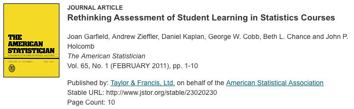

```{r setup, include=FALSE}
knitr::opts_chunk$set(echo = FALSE)
```

## Outline

#### Part 1: Good teaching (TA-ing)
  
  - (your) Personal experiences  
  - Best practices

#### Part 2: Being a good teacher (TA)
  
  - Running Labs
  - Office Hours
  - Student Email 
  - Grading 
  - General Tips (everyone) 


#### Website with session content:


## Part 1: Good teaching (TA-ing)

<br>

### What have teachers done that has worked best for you?? 

<br>

<br>

<br>

(Here's the same QR code again if I changed slides too quickly...) 


## What have teachers done that has worked best for you?? 

<br>

### They way *you* learn most efficiently isn't optimal for *everyone* ... and **maybe not even most** 

<br> 

- Some students will learn and succeed no matter how good or bad the teaching is 
- Students in the same course may have very different reasons for being there (producers & consumers)
- The challenge is generally to optimize the efficiency of teaching & learning so that you are doing the most good for the most students 


## ASA's GAISE Guidelines

- This is the latest in several iterations of recommendations for statistics education
- The document reads with a bias toward introductory courses (because that's the widest audience), but the principles apply readily to more advanced courses
- Several appendices with lots of examples, ideas, resources, and references

<br>


## The GAISE Recommendations

1. Teach statistical thinking
    - Teach statistics as an investigative process of problem-solving & decision-making
    - Give students experience with multivariable thinking
2. Focus on conceptual understanding
3. Integrate real data with a context and purpose
4. Foster active learning
5. Use technology to explore concepts and analyze data
6. Use assessments to improve and evaluate student learning


## The GAISE Recommendations

1. **Teach statistical thinking**
    - Teach statistics as an investigative process of problem-solving & decision-making
    - Give students experience with multivariable thinking

<br> 

Use the content of the course as a platform to demonstrate *how statisticians think* to your students.  


## The GAISE Recommendations

1. Teach statistical thinking
    - Teach statistics as an investigative process of problem-solving & decision-making
    - Give students experience with multivariable thinking
2. **Focus on conceptual understanding**

<br>

Developing sound intuition and promoting synthesis is generally more valuable than practicing the mechanics of seemingly disjoint methods

## The GAISE Recommendations

1. Teach statistical thinking
    - Teach statistics as an investigative process of problem-solving & decision-making
    - Give students experience with multivariable thinking
2. Focus on conceptual understanding
3. **Integrate real data with a context and purpose**

<br> 

In general, the point you want to make--*and the reason you want to make it*--is much more compelling to students within the context of real data than through the use of a "toy" or contrived data set.


## The GAISE Recommendations

1. Teach statistical thinking
    - Teach statistics as an investigative process of problem-solving & decision-making
    - Give students experience with multivariable thinking
2. Focus on conceptual understanding
3. Integrate real data with a context and purpose
4. **Foster active learning**

<br> 

*Generally, no more than 15 minutes should go by without students doing something active*


## The GAISE Recommendations

1. Teach statistical thinking
    - Teach statistics as an investigative process of problem-solving & decision-making
    - Give students experience with multivariable thinking
2. Focus on conceptual understanding
3. Integrate real data with a context and purpose
4. Foster active learning
5. **Use technology to explore concepts and analyze data**

<br> 

Statistical software, Shiny Apps, Web Applets, etc, are powerful resources to promote learning and seperate superficial details from structural details


## The GAISE Recommendations

1. Teach statistical thinking
    - Teach statistics as an investigative process of problem-solving & decision-making
    - Give students experience with multivariable thinking
2. Focus on conceptual understanding
3. Integrate real data with a context and purpose
4. Foster active learning
5. Use technology to explore concepts and analyze data
6. **Use assessments to improve and evaluate student learning**

<br> 

Assessment *of* learning: Measure student learning outcomes [summative]  

Assessment *as* learning: Students should learn from the assessment (feedback, review solutions, etc) [formative]  

Assessment *for* learning: (you) Use assessments to learn about your class, and modify instruction accordingly [evaluative]  

<br> 



## Part 1: Good teaching (TA-ing)

- Use examples: 2 example rule
    - for each topic: you do an example (guided practice), then have students do an example (independent practice)
- Teach at the right level
    - challenge students, but make sure they are keeping up
- Use real data with a context rather than artificial data wherever possible
- Emphasize concepts, not just calculations


## Part 2: Being a good teacher (TA)

- Running Labs
- Office Hours
- Student Email 
- Grading 
- General Tips (everyone) 

## Small Group Discussion

- Break into groups with a few of the people nearby 
- Include at least one experienced TA in each group if possible
- Each group will be assigned one (or two) of the following discussion topics:  
    1. Running Labs
    2. Office Hours
    3. Student Email 
    4. Grading 
    5. General Tips (everyone) 

<br> 

Spend a few minutes listing tips & recommendations. If you haven't been a TA or instructor before, think about what your own TA's & instructors have done well.

## Running Labs

1. **Running Labs**
2. Office Hours
3. Student Email 
4. Grading 
5. General Tips (everyone) 


## Running Labs

- Work through lab in advance
- Walk around and engage with students (especially when you aren't presenting)
- Help them learn how to debug for themselves
- Encourage collaboration
- Be approachable

## Office Hours 

1. Running Labs
2. **Office Hours**
3. Student Email 
4. Grading 
5. General Tips (everyone) 

## Office Hours 

- Be familiar with current course material in advance (topics, terminology, notation…)  
- The goal is learning, not just correct answers
    - Don’t just give answers: give guidance as needed to help them figure it out
    - Be patient and try never to take their pencil or paper from them
- Encourage students to work together
- Use the board (Better yet have students use the board if possible)
- Concrete examples help when explaining concepts (draw a picture, show them an example in the book, etc)

## Student email 

1. Running Labs
2. Office Hours
3. **Student Email** 
4. Grading 
5. General Tips (everyone) 

## Student email 

- Make sure students know your email and know they can contact you
- Respond in a timely manner (within 24 hours)
- Email is best for short, straightforward replies – don’t drive yourselves crazy!
- For longer subject matter questions, give a short remark and refer them to office hours
- Don’t let emails go unanswered


## Grading

1. Running Labs
2. Office Hours
3. Student Email 
4. **Grading** 
5. General Tips (everyone) 

## Grading

- Be fair & consistent
    - use a predetermined rubric, checklist, etc. with predetermined criteria associated with point values whenever possible... save this so you can show students how they were graded
    - grade one problem (or page) for the whole class, then the next problem (or page) for the whole class, and so on
- Provide useful feedback; help them learn from their mistakes
- Stay in touch with the instructor
- Keep a document of common mistakes (and feedback)
- Try to be efficient/timely


## General

1. Running Labs
2. Office Hours
3. Student Email 
4. Grading 
5. **General Tips (everyone)** 

## General

- Be friendly & approachable
- Students will often mirror your demeanor
    - if you're having fun, it's more fun for them
    - if you're bored, they are too
- Be nice but in charge
- Always treat students with respect
- Care about your students and sincerely want them to succeed
- Smile a lot

